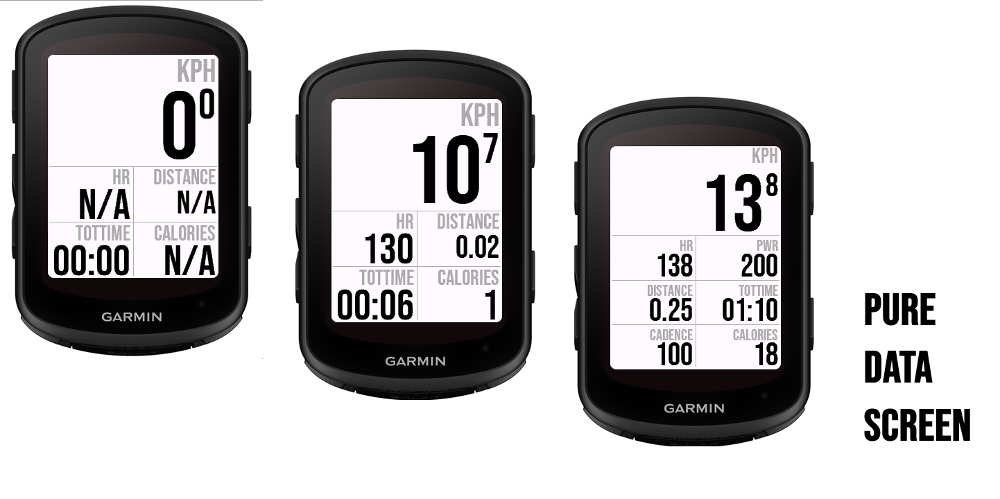

# PureDataScreen



## About PureDataScreen

A clean data field for Wahoo nostalgic ;)
It is a 1 Field data screen with two pre-configured layouts (1+4 and 1+6).

How to use:

- using Garmin Connect select your Edge Device - Activity Profiles - Select the profile you want to change
- Select Data Screens - Add Data Screen - Data Screen - 1 Field
- Now on your edge device select the activity profile of choice (the one where you have added the new field)
- Navigate to the newly added field
- Edit it by pressing and holding the menu button. Press again the menu to edit.
- Select the Category "Connect IQ"
- Select "PureDataScreen"

From Connect IQ you can switch between the predefined layouts 1+4 or 1+6.

## Getting Started

### Prerequisites

To contribute to PureDataScreen, you'll need:

* Visual Studio Code
* Monkey C extension

### Installation

1.  **Clone the repository:**
    ```bash
    git clone https://github.com/marekside/PureDataScreen.git
    ```

### Usage

## Contributing

We welcome contributions to PureDataScreen! If you'd like to contribute, please follow these steps:

1.  **Fork the repository.**
2.  **Create a new branch** for your feature or bug fix: `git checkout -b feature/your-feature-name` or `bugfix/fix-description`.
3.  **Make your changes.**
4.  **Commit your changes:** `git commit -m "feat: Add new feature"`. (Consider Conventional Commits for better commit messages).
5.  **Push to your branch:** `git push origin feature/your-feature-name`.
6.  **Open a Pull Request** to the `main` branch of this repository.

## License

This project is licensed under the terms of the **PureDataScreen Non-Commercial Use License**.

---

### PureDataScreen Non-Commercial Use License

Copyright (c) [Year of first publication, e.g., 2024-2025] [Your Name or Entity Name]

**1. Definitions**

* "Software" refers to the PureDataScreen project, including all associated source code, documentation, and other materials.
* "Non-Commercial Use" means use of the Software purely for personal learning, academic research, educational purposes, hobby projects, or other purposes where there is no direct or indirect financial gain, profit, or commercial advantage derived from the use, distribution, or creation of derivative works of the Software. This explicitly excludes any use by or for any business, company, organization, or individual for commercial purposes, including but not limited to:
    * Selling, licensing, or renting the Software.
    * Using the Software in commercial products or services.
    * Performing services for a fee using the Software.
    * Any use that directly or indirectly generates revenue, even if that revenue is reinvested into a non-profit organization.

**2. Permitted Use**

You are granted a non-exclusive, non-transferable, revocable license to:

* Use the Software for Non-Commercial Use only.
* Modify the Software for Non-Commercial Use only.
* Distribute the Software (and any modifications) for Non-Commercial Use only, provided that this License is included in its entirety with any distribution.

**3. Restrictions**

You may NOT:

* Use the Software, or any derivative works thereof, for any commercial purpose whatsoever.
* Sell, sublicense, rent, lease, or lend the Software.
* Distribute the Software without including this License.
* Remove or alter any copyright or proprietary notices.

**4. No Warranty**

THE SOFTWARE IS PROVIDED "AS IS", WITHOUT WARRANTY OF ANY KIND, EXPRESS OR IMPLIED, INCLUDING BUT NOT LIMITED TO THE WARRANTIES OF MERCHANTABILITY, FITNESS FOR A PARTICULAR PURPOSE AND NONINFRINGEMENT. IN NO EVENT SHALL THE AUTHORS OR COPYRIGHT HOLDERS BE LIABLE FOR ANY CLAIM, DAMAGES OR OTHER LIABILITY, WHETHER IN AN ACTION OF CONTRACT, TORT OR OTHERWISE, ARISING FROM, OUT OF OR IN CONNECTION WITH THE SOFTWARE OR THE USE OR OTHER DEALINGS IN THE SOFTWARE.

---

## Contact

- If you have any questions or feedback, feel free to open an issue on this repository or contact me at [casamassima.marco.biz@gmail.com - Optional, but good for direct queries].
- Garmin [release page](https://apps.garmin.com/apps/cd764625-fbee-448e-b030-a6719ba287a5)

---

